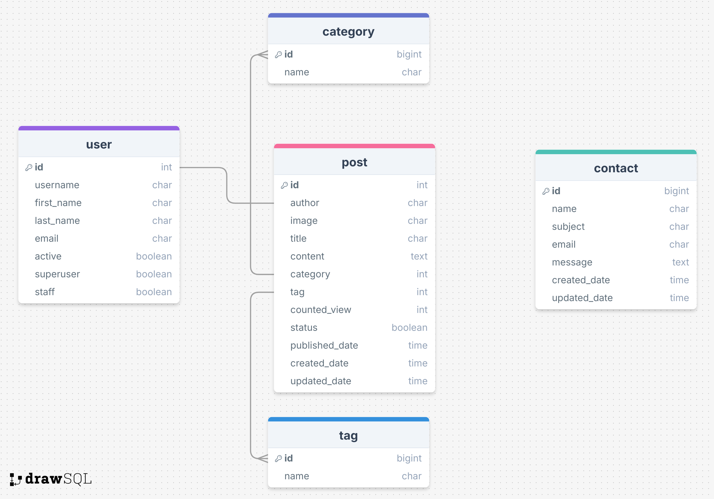

# Django Blog Platform

A full-featured blog platform built with Django, supporting user authentication, categorized posts, tagging, view tracking, and a contact system.

---

## Features

- **User Authentication** — Register, login, and manage user accounts
- **Blog Posts** — Create, edit, and publish posts with image support
- **Categories & Tags** — Organize content with a flexible classification system
- **View Counter** — Tracks how many times each post has been viewed
- **Contact Form** — Visitors can send messages directly through the site
- **Admin Panel** — Full Django admin interface for content management
- **Responsive Design** — Built with SCSS for a clean, mobile-friendly UI

---

## Tech Stack

| Layer | Technology |
|-------|-----------|
| Backend | Python · Django |
| Frontend | HTML · CSS · SCSS · JavaScript |
| Database | SQLite (development) |
| Auth | Django built-in authentication |

---

## Database Schema

The data model includes five tables with the following relationships:

- A **Post** belongs to one **User** (author), one **Category**, and one **Tag**
- **Contact** stores visitor messages independently
- Posts track `status`, `counted_view`, `published_date`, `created_date`, and `updated_date`



---

## Getting Started

### Prerequisites

- Python 3.10+
- pip

### Installation

```bash
# Clone the repository
git clone https://github.com/Afsaneh-hassani/django-blog-platform.git
cd django-blog-platform

# Create a virtual environment
python -m venv venv
source venv/bin/activate  # On Windows: venv\Scripts\activate

# Install dependencies
pip install -r requirements.txt

# Apply migrations
python manage.py migrate

# Create a superuser
python manage.py createsuperuser

# Run the development server
python manage.py runserver
```

🌐 Live Demo: [your-url-here].

---

## Project Structure

```
django-blog-platform/
├── accounts/        # User registration and authentication
├── blog/            # Post, category, tag logic and views
├── website/         # Core app and URL configuration
├── templates/       # HTML templates
├── static/          # CSS, SCSS, JavaScript, images
└── requirements.txt
```

---

## Author

**Afsaneh Hassani**  
PhD in Mathematics (Geometrical Optics & Dynamical Systems)  
[LinkedIn](https://linkedin.com/in/afsaneh-hassanisaleh-194120148) · [GitHub](https://github.com/Afsaneh-hassani)

---

## License

This project is licensed under the MIT License.
